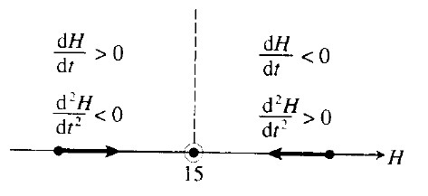
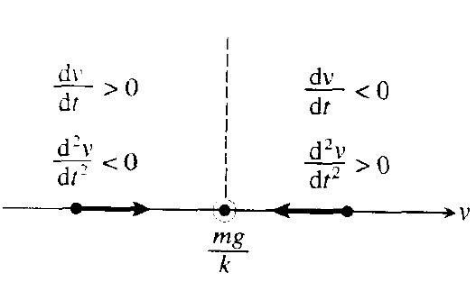
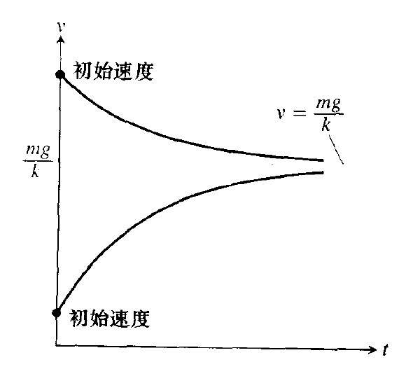
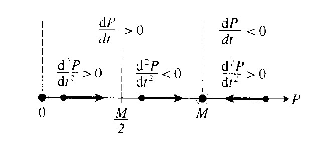
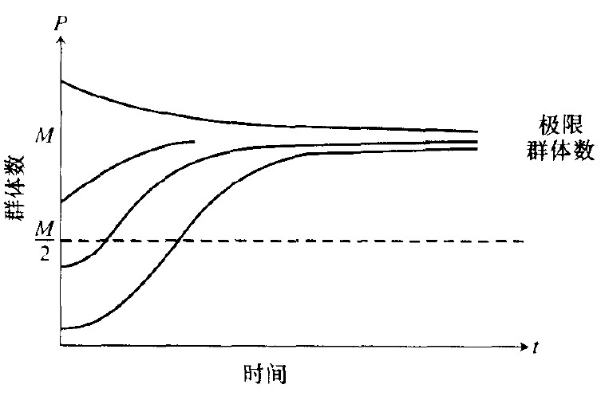
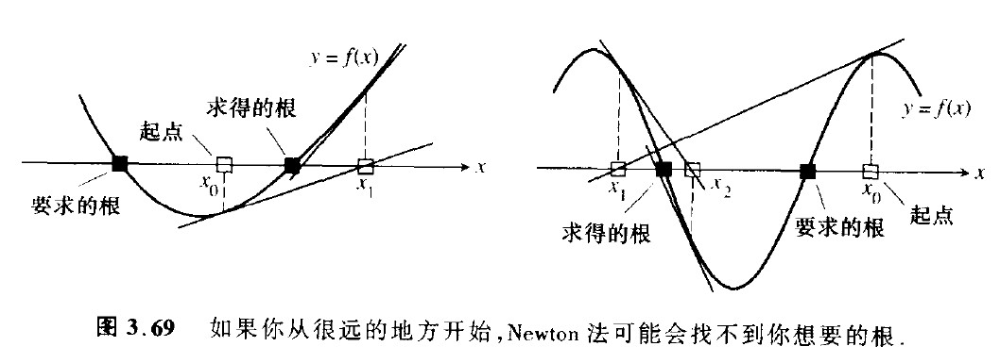
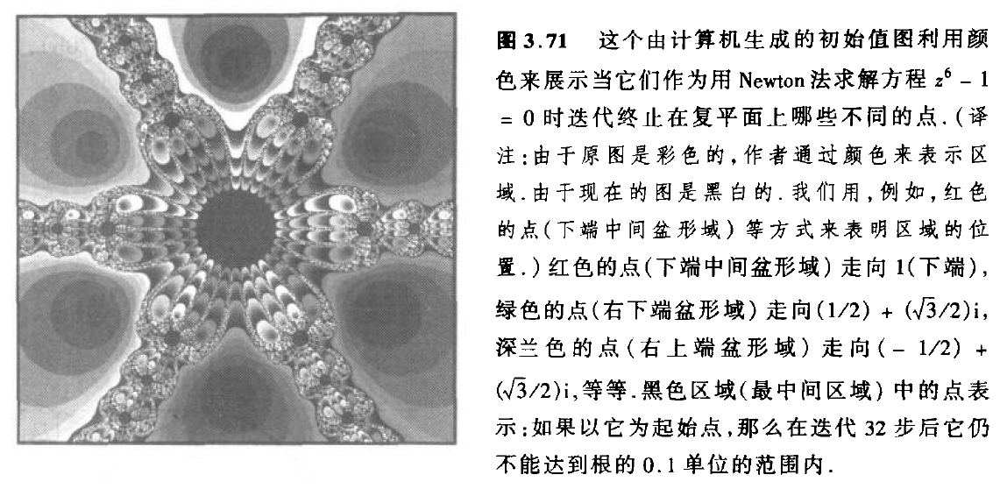

## 导数的应用

### 极值

绝对极值（最值）（最大、最小）

相对极值（局部）（$\rightarrow f'(c)=0$）

临界点（$\Leftrightarrow f'(c)=0或f(c)=0$）

### 极值相关定理

- **定理 1** 连续函数的极值定理

  > 对于在闭区间 $I$ 上的连续函数 $f(x)$ ，在某些点处能取到最大值 $M$ 和最小值 $m$ ，那么对于 $I$ 中的所有 $x$ ，都有 $m \le f(x) \le M$。
  > （废话）

- **定理 2**
  > 在函数$f$的定义域内点$c$处取到局部最大值或局部最小值，点$c$也存在导数，那么$f'(c)=0$。

### 微分中值定理

- **定理 1** 罗尔定理

  > 定义在$[a,b]$的连续可微函数$f(x)$，如果
  > $$f(a)=f(b)=0$$
  > 那么至少有一个数$c$使得$f'(c)=0$

- **定理 2** 微分中值定理
  > 定义在$[a,b]$上的连续可微函数$f(x)$，那么$(a,b)$内存在一点 c，使得
  > $$\frac{f(b)-f(a)}{b-a}=f'(c)$$

我们可以看到，罗尔定理其实是微分中值定理的特殊情况。

### 图形的形状

增减函数检验

1. 定义检验
2. 一阶导数正负检验

局部极值的检验  
一阶导：

1. 局部**极小值**，$f'(x)$从负变正
2. 局部**极大值**，$f'(x)$从正变负
3. 没有局部极值，$f'(x)$两边同号

二阶导：

1. $f'(c)=0$ 且 $f''(c) \gt 0$，那么$f$在$x=c$处取得极小值
2. $f'(c)=0$ 且 $f''(c) \lt 0$，那么$f$在$x=c$处取得极大值

凹性

1. **凹向上**，$y'' \gt 0$
2. **凹向下**，$y'' \lt 0$

拐点

> 凹性改变的点，叫做**拐点**。
> 二阶导函数等于零，且一阶导函数有极大值或极小值的点是拐点。  
> 但二阶导数等于零也不一定是拐点，二阶导数不存在也可能是拐点。

### 自治微分方程的图形解

- **自治微分方程**

> 导数只是关于 y 的函数，我们称该方程为自治微分方程。

- 平衡点/静止点

> 使自治微分方程$\dfrac{dy}{dx}=g(y)$等于零的 y 值，称之为平衡点或静止点。

- 相直线

> 是一条用来表示函数的高阶导数的正负性的数轴。

借助相直线，我们可以得到自洽微分方程的图形解（没有表达式，但知道解的函数大致图像）。

### 三个案例

#### 冷却

假设环境摄氏温度为$P$，汤的温度为$H$，经过的时间为$t$，我们还假设环境足够大，使得汤的温度对环境的影响忽略不计。根据牛顿的冷却定律有：

$$
\frac{dH}{dt} = -k(H - P)
$$

当$H \gt P$时，$\dfrac{dH}{dt} \lt 0$。

经过求导之后，画出相直线。  

微分方程的图形解如图：  

图中的 15 是一个稳定的平衡点，上下的两条直线都稳定朝 15 靠近。

#### 分析有阻力时的落体

按照动量定理，我们有：

$$
F=\frac{d}{dt} (mv) = m \frac{dv}{dt} + v \frac{dm}{dt} = m \frac{dv}{dt}
$$

当物体在介质中下落时，往往会受到阻力，阻力往往与速度相关，这时得到的公式为：

$$
F = F_g - F_v = m (g -  kv),  \newline
a = g - \frac{kv}{m}.
$$

当物体受到的合力$F=0$时，速度便稳定下来，故稳定速度为$v = \frac{mg}{k}$
我们考察速度的变化过程：

$$
\frac{d^2v}{dt^2} = \frac{d}{dt} (g - \frac{k}{m} v) = - \frac{k}{m} \frac{dv}{dt}
$$

画出相直线：  

画出图形解：  

阻力图形解

#### logistic 增长

假设$P=P(t)$为某个种群的数目，在时间$\Delta t$内，种群的增长率为$k$，则种群数目为：
$$\frac{\Delta P}{\Delta t}=kP(t)$$
$k \gt 0$是种群的增长率，对增长率进行假设：在自然界中，由于**有限的资源**，我们通常会假设一个**极限种群**或**承载容量**$M$，资源变得短缺了，种族的增长率$k$便会降低，

$$
k = r(M-P)
$$

$r$代表了增长率变化的速度，对$k$进行代换得到：

$$
\frac{dP}{dt} = r(M-P)P=rMP-rP^2
$$

该模型称之为**logistic 增长模型**。

考察该模型的函数性态，我们对上述模型两边求导：

$$
\frac{d^2P}{dt^2} = rM \frac{dP}{dt} - 2rP \frac{dP}{dt}=r \frac{dP}{dt} (M - 2P)
$$

画出相直线得：

logistic 增长相直线

画出图形解：  

logistic 增长图形解

我们可以看到，拐点在$\frac{M}{2}$位置处。

### 建模和最优化

- 求解最大-最小问题
  > 1. 了解问题
  > 2. 研制一个该问题的数学模型
  > 3. 求该函数的定义域
  > 4. 识别临界点和端点
  > 5. 求解该数学模型
  > 6. 对解进行解释

书中使用了 Fermat 原理和 Snell 定律来进行建模举例。

> Fermat 原理：光在介质中传播永远以时间最短的路径传播。  
> Snell 定律：在介质之间相互传播的时候，入射角和折射角满足一定的关系：
>
> $$
> \frac{\sin \theta_1}{c_1} = \frac{\sin \theta_2}{c_2}
> $$

### 线性化和微分

- 线性化

> 如果$f$在$x = a$可微，那么近似函数
>
> $$
> L(x) = f(a) + f'(a) (x - a)
> $$
>
> 就是$f$在$a$的**线性化**
> 近似$f(x) \approx L(x)$是$f$在$a$的**标准线性近似**，点$a$就是线性中心。

- 微分

> 设$y = f(x)$是一个可微函数，微分$dx$是一个自变量。微分$dy$是
>
> $$
> dy = f'(x)dx
> $$
>
> 变量$dy$永远是一个因变量，它既依赖于$x$，又依赖$dx$.

- 根式函数和幂函数的线性化

  $$
  (1+x)^k \approx 1 + kx
  $$

- 在$x = 0$附近常用线性化

  $$
  \sin x \approx x ,\  \cos x = 1 ,\  \tan x \approx x
  $$

- 绝对变化
  - 估计变化
    $$
    \Delta f = f(a + dx) - f(a)
    $$
  - 实际变化
    $$
    df = f'(a)dx
    $$
- 相对变化
  - 估计的变化
    $$
    \frac{df}{f(a)}
    $$
  - 实际变化
    $$
    \frac{\Delta f}{f(a)}
    $$

#### 变化的敏感度

由$df = f'(x)dx$，我们知道$f'(x)$可以衡量$f$对$dx$的敏感程度。（这一点可能在多变量的情形下起作用）

#### 微分变化估计实际变化的误差

- 估计误差

> $$
> \begin{aligned}
> \Delta f - df
>  & = f(a + \Delta x) - f(a) - f'(a) \Delta x \\
>  & = \Delta x  (\dfrac{f(a + \Delta x) - f(a)}{\Delta x} - f'(a))
> \end{aligned}
> $$
>
> 令 $\dfrac{f(a + \Delta x) - f(a)}{\Delta x} - f'(a) = \epsilon,$
> 则上式 $= \Delta x \epsilon$
> 当 $\Delta x \rightarrow 0$ 时，$\epsilon \rightarrow 0$.

### Newton 法

本节介绍一个求解根的方法：牛顿(Newton)法

- Newton 法

> 通过切线的零点，确定下一条切线，再根据下一条切线的零点，确定再下一条切线......如此循环往复，最后得到要找的根。如下图：  
>   
> Newton 法
> 由线性化可知，牛顿法代数上计算就是根据给定的$x_0$求得$f(x_0)$和$f'(x_0)$再代入：
>
> $$
> x = x_n - \frac{f(x_n)}{f'(x_n)}
> $$
>
> 然后循环以上步骤，直至$x_n$收敛于某个固定的值（也可能不收敛，此时$f(x)$无零点。

Newton 法失效的情况：

- 当$f'(x_n) = 0$时，Newton 法就会停下来，这时便需要选择别的起点；
- Newton 法有时会陷入无限循环，无法收敛。

求得的根不是想要的根的情况：

Newton 法不是想要的根

- 分形盆

> 我们使用 Newton 法解 $z^6 - 1 = 0$，我们根据不同的起始点，经过多次迭代之后得到如图：  
>   
> 这一个个盆形区域被称为**分形盆**，这六个分形盆他们分别导向这个复数方程的六个解$1,-1, \pm \sqrt{3} / 2, \pm 1/2$
