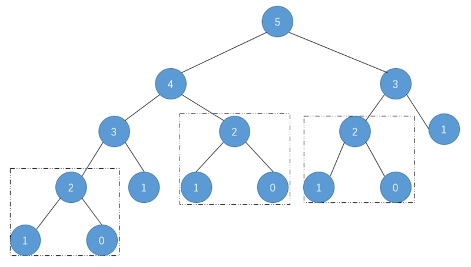

## 动态规划

动态规划问题：多阶段决策，通过多个阶段的决策最后得到的效益（损失），通过每个阶段选择合适的决策，最终得到最优的结果，这样的问题称之为多阶段决策问题。

**状态**：每个阶段的决策都会产生一个状态，每个阶段的状态都会影响到下一个阶段的初始状态。
**决策**：每个阶段所选择的方案。
决策和状态共同影响着该阶段的**效益**。

从每个阶段的状态都会影响到下一个阶段的状态来看，这其实满足一个递归问题的条件。
将递归问题画成递归树的形式，我们用递归算法来解决，实际上是一个自顶向下的过程，随着递归树的深入我们往往会发现越来越多的计算都是重复的，例如斐波那契数列的递归树：

图中重复的结点个数就是重复计算的次数。
我们可以使用带备忘的递归算法，将每次计算的结果用一个 `map` 或者 `dict` 保存起来，但这样做无非是用空间换了时间，实际上我们要计算第 $n$ 次递归的结果，只需要知道最近两次计算的结果就好了（对于斐波那契数列的计算），所以我们如果采用自底向上的计算方法，每次只保存需要的数据，我们就能将空间复杂度控制下来，而时间复杂度和带备忘的递归是一样的。这种计算方法就是动态规划。
