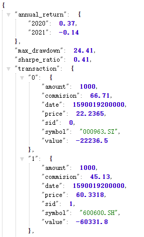

## 毕业设计

基于区块链的智能投顾系统

### 搭建网络

要素：

- Org
  - provider.mynetwork.com
  - subscriber.mynetwork.com
  - regulator.mynetwork.com
  - orderer.mynetwork.com
- Peers
  - peer0.provider.mynetwork.com
    - PEER0_PROVIDER_ADDRESS=localhost:6001
    - CORE_PEER_CHAINCODEADDRESS=peer0.provider.mynetwork.com:6002
    - couchdb0
      - 10050:5984
  - peer0.subscriber.mynetwork.com
    - PEER0_SUBSCRIBER_ADDRESS=localhost:6003
    - CORE_PEER_CHAINCODEADDRESS=peer0.subscriber.mynetwork.com:6004
    - couchdb1
      - 10051:5984
  - peer0.regulator.mynetwork.com
    - PEER0_REGULATOR_ADDRESS=localhost:6005
    - CORE_PEER_CHAINCODEADDRESS=peer0.regulator.mynetwork.com:6006
    - couchdb3
      - 10052:5984
- Orderer
  - ORDERER_ADDRESS=localhost:6007
- CA
  - ca_provider
    - FABRIC_CA_SERVER_PORT=9201
  - ca_subscriber
    - FABRIC_CA_SERVER_PORT=9202
  - ca_regulator
    - FABRIC_CA_SERVER_PORT=9203
  - ca_orderer
    - FABRIC_CA_SERVER_PORT=9204

调用流程：

```bash
. ./rebuild.sh
. ./scripts/deploy_chaincode.sh deploy v1.0 mycc
. ./scripts/init_chaincode.sh mycc InitLedger Peer1.Subscriber
. ./scripts/test_chaincode.sh mycc Peer1.Subscriber query GetAllAssets ""
. ./scripts/test_chaincode.sh mycc Peer1.Subscriber invoke DeleteAsset asset6
. ./scripts/test_chaincode.sh mycc Peer1.Subscriber invoke CreateAsset '{\"ID\":\"asset7\",\"color\":\"white\",\"size\":15,\"Owner\":\"Michel\",\"appraisedValue\":800}'
. ./scripts/test_chaincode.sh mycc Peer1.Subscriber invoke CreateAsset '{\"ID\":\"asset6\",\"color\":\"white\",\"size\":15,\"owner\":{\"name\":\"Michel\",\"age\":999},\"appraisedValue\":800}'
```

com.graduationProject.mynetwork.EnrollAdmin
com.graduationProject.entity.Admin

. ./scripts/deploy_chaincode.sh deploy v1.0 strategy

{
"ID": "asset7",
"color": "white",
"size": 15,
"Owner": "Michel",
"appraisedValue": 800
}

通过命令行传参需要压缩 json 对象，并转义引号才能正确传入。

{\"ID\":\"asset6\",\"Color\":\"white\",\"Size\":15,\"Owner\":{\"Name\":\"Michel\",\"Age\":999},\"AppraisedValue\":800}

通过 mycc 的 CreateAsset 函数，证明了结构体也可以正确传值，
{\"ID\":\"asset7\",\"color\":\"white\",\"size\":15,\"Owner\":\"Michel\",\"appraisedValue\":800}

peer chaincode query -o localhost:7050 --ordererTLSHostnameOverride orderer.example.com --tls --cafile ${PWD}/organizations/ordererOrganizations/example.com/orderers/orderer.example.com/msp/tlscacerts/tlsca.example.com-cert.pem -C mychannel -n private -c '{"function":"ReadAssetPrivateDetails","Args":["Org2MSPPrivateCollection","asset1"]}'

peer chaincode query -C mychannel -n private -c '{"function":"ReadAssetPrivateDetails","Args":["Org1MSPPrivateCollection","asset1"]}'

私有数据请求

peer chaincode query -o localhost:7050 --ordererTLSHostnameOverride orderer.example.com --tls --cafile ${PWD}/organizations/ordererOrganizations/example.com/orderers/orderer.example.com/msp/tlscacerts/tlsca.example.com-cert.pem -C mychannel -n private -c '{"function":"ReadAssetPrivateDetails","Args":["Org2MSPPrivateCollection","asset1"]}'

修改私有数据

peer chaincode invoke -o localhost:7050 --ordererTLSHostnameOverride orderer.example.com --tls --cafile ${PWD}/organizations/ordererOrganizations/example.com/orderers/orderer.example.com/msp/tlscacerts/tlsca.example.com-cert.pem -C mychannel -n private -c '{"function":"AgreeToTransfer","Args":[]}' --transient "{\"asset_value\":\"$ASSET_VALUE\"}"

私有数据的传输要走 Transaction ，在 CLI 中要设置 --transient 通道，在 SDK 中可以通过 gateway 取得 Transient 对象进行传输，链码中通过 GetTransient() 取得 transientMap ，通过 transientMap 可以得到传进来的值；（其实就是私有数据，私有数据要保证隐私性所以不会通过通道直接传输；

我们的私有数据，
用户 A
用户 B
提供者 C

策略 A 是公开策略，它可以放在 ABC 公共数据集中，
策略 B 是私有策略，它放在收益放在 C 的公共数据集中，交易记录、持仓记录放在 C 的私有数据集中，订阅数据放在公共数据集中，不同用户对数据的访问控制通过 GetCreator() 来控制，这是基于链码的访问控制；

strategy_provide.go
SaveStrategy()
SaveStrategyPrivate()
UpdateStrategy()
SetStrategyPrivate()
SetStrategyPublic()
DeleteTrades()

strategy_queries.go
GetAllStrategies()
StrategyExists()
ReadStrategy()
ReadTrades()
ReadPositions()

### 资产数据结构

资产(Assets)也是世界状态，存储在每个节点的状态 DB 中，是可以增删改查的存在；
交易(Transaction)是链上的区块数据，资产的状态发生变化时，就会产生交易数据，是只能增加的数据，不可篡改；

```go
// SmartContract definition
type SmartContract struct {
	contractapi.Contract
}

type Trade struct {
	ID         string    `json:"ID"`         // 交易id
	StockID    string    `json:"stockID"`    // 交易股票
	Amount     float64   `json:"amount"`     // 交易份额（买卖用正负来表示）
	Commission float64   `json:"commission"` // 交易佣金
	DateTime   time.Time `json:"dateTime"`   // 交易时间
	Price      float64   `json:"price"`      // 成交价
}

type Position struct {
	ID     string  `json:"ID"`     // 股票代码
	Price  float64 `json:"Price"`  // 现有股价
	Amount float64 `json:"amount"` // 仓位
}

type Strategy struct {
	ID           string     `json:"ID"`           // 策略 ID
	Name         string     `json:"name"`         // 策略名
	Provider     string     `json:"provider"`     // 发布者
	MaxDrawdown  float64    `json:"maxDrawdown"`  // 最大回撤
	AnnualReturn float64    `json:"annualReturn"` // 年化收益率
	Trades       []Trade    `json:"trades"`       // 交易记录
	Positions    []Position `json:"positions"`    // 持仓
}
```

### 链码 chaincode

链码安装脚本：deploy_chaincode.sh [-u]

为哪个组织安装链码,设置哪个组织环境变量：

```bash
setupSubscriberPeerENV0
setupSubscriberPeerENV1
setupProviderPeerENV
setupRegulatorPeerENV
```

```bash
# 链码名
export CC_NAME=strategy
# 链码版本
export CC_VERSION=v1.0
# 链码序列号
export CC_SEQ=1
# 链码策略
# export CC_POLICY="OR('ProviderMSP.peer', 'SubscriberMSP.peer', 'RegulatorMSP.peer')"
export CC_POLICY="OR('ProviderMSP.peer')"
# 可以不设置,自己用来过滤脚本用的
export CC_LIFECYCLE="DEPLOY"
export CC_LABEL=${CC_NAME}_${CC_VERSION}
# 设置 Go 链码的变量
setGoCC

# 检查是否配置了私有数据集合配置文件
if [[ -f ${CC_PATH}/../../collections_config.json ]]; then
    export PRIVATE_COLLECTION_DEF="--collections-config ${CC_PATH}/../../collections_config.json"
fi
```

```bash
pushd $CC_PATH
./build.sh
popd
```

#### 链码打包

```bash
set -x
if [[ ! -f tmp/${CC_LABEL}.tar.gz ]]; then
    peer lifecycle chaincode package tmp/${CC_LABEL}.tar.gz --path ${CC_PATH} --lang $CC_LANG --label ${CC_LABEL}
fi
set +x
```

#### 安装链码

依次切换环境变量执行下面的代码:

```bash
setupSubscriberPeerENV0
setupSubscriberPeerENV1
setupProviderPeerENV
setupRegulatorPeerENV

peer lifecycle chaincode install tmp/${CC_LABEL}.tar.gz
```

检查链码安装情况:

```bash
PACKAGE_ID=$(peer lifecycle chaincode queryinstalled --output json | jq -r '.installed_chaincodes[] | select(.label == env.CC_LABEL) | .package_id')
echo "PACKAGE_ID('$ORGANIZATION_NAME'):" ${PACKAGE_ID}
```

#### 为自己的组织批准链码

```bash
if [[ "$CORE_PEER_TLS_ENABLED" == "true" ]]; then
    peer lifecycle chaincode approveformyorg \
        -o ${ORDERER_ADDRESS} \
        --ordererTLSHostnameOverride orderer.mynetwork.com \
        --tls $CORE_PEER_TLS_ENABLED \
        --cafile $ORDERER_CA \
        --channelID $CHANNEL_NAME \
        --name ${CC_NAME} \
        --version ${CC_VERSION} \
        --init-required \
        --package-id ${PACKAGE_ID} \
        --sequence $CC_SEQ \
        --waitForEvent \
        --signature-policy "$CC_POLICY" \
        $PRIVATE_COLLECTION_DEF
else
    peer lifecycle chaincode approveformyorg \
        -o ${ORDERER_ADDRESS} \
        --channelID $CHANNEL_NAME \
        --name ${CC_NAME} \
        --version ${CC_VERSION} \
        --init-required \
        --package-id ${PACKAGE_ID} \
        --sequence $CC_SEQ \
        --waitForEvent \
        --signature-policy "$CC_POLICY" \
        $PRIVATE_COLLECTION_DEF
fi
```

#### 提交链码定义

```bash
if [[ "$CORE_PEER_TLS_ENABLED" == "true" ]]; then
    peer lifecycle chaincode commit \
        -o ${ORDERER_ADDRESS} \
        --ordererTLSHostnameOverride orderer.mynetwork.com \
        --tls $CORE_PEER_TLS_ENABLED \
        --cafile $ORDERER_CA \
        --peerAddresses $PEER0_PROVIDER_ADDRESS \
        --tlsRootCertFiles $PEER0_PROVIDER_TLS_ROOTCERT_FILE \
        --peerAddresses $PEER0_SUBSCRIBER_ADDRESS \
        --tlsRootCertFiles $PEER0_SUBSCRIBER_TLS_ROOTCERT_FILE \
        -C $CHANNEL_NAME \
        --name ${CC_NAME} \
        --version ${CC_VERSION} \
        --sequence $CC_SEQ \
        --init-required \
        --signature-policy "$CC_POLICY" \
        $PRIVATE_COLLECTION_DEF
else
    peer lifecycle chaincode commit -o ${ORDERER_ADDRESS} \
        --peerAddresses $PEER0_PROVIDER_ADDRESS \
        --peerAddresses $PEER0_SUBSCRIBER_ADDRESS \
        -C $CHANNEL_NAME \
        --name ${CC_NAME} \
        --version ${CC_VERSION} \
        --sequence $CC_SEQ \
        --init-required \
        --signature-policy "$CC_POLICY" \
        $PRIVATE_COLLECTION_DEF
```

检查链码状态

```bash
peer lifecycle chaincode querycommitted --channelID $CHANNEL_NAME --name ${CC_NAME}
```

#### 调用前实例化链码

```bash
if [[ "$CORE_PEER_TLS_ENABLED" == "true" ]]; then
    peer chaincode invoke \
    -o ${ORDERER_ADDRESS} \
    --ordererTLSHostnameOverride orderer.mynetwork.com \
    --tls $CORE_PEER_TLS_ENABLED \
    --cafile $ORDERER_CA \
    -C $CHANNEL_NAME \
    -n ${CC_NAME}  \
    --isInit -c '{"Function":"'Init'","Args":[]}'
else
    peer chaincode invoke \
    -o ${ORDERER_ADDRESS} \
    -C $CHANNEL_NAME \
    -n ${CC_NAME}  \
    --isInit -c '{"Function":"'$INIT_FUNC'","Args":[]}'
fi
```

#### query 调用链码

不需要修改链上数据的用这个请求:

```bash
peer chaincode query -C $CHANNEL_NAME -n $CC_NAME -c '{"Function":"GetAllStrategies", "Args":[]}'
```

#### invoke 调用链码

需要修改数据的用这个:

```bash
if [[ "$CORE_PEER_TLS_ENABLED" == "true" ]]; then
    peer chaincode invoke \
    -o ${ORDERER_ADDRESS} \
    --ordererTLSHostnameOverride orderer.mynetwork.com \
    --tls $CORE_PEER_TLS_ENABLED \
    --cafile $ORDERER_CA \
    -C $CHANNEL_NAME \
    -n ${CC_NAME}  \
    -c '{"Function":"'$INVOKE_FUNC'","Args":["'$INVOKE_FUNC_ARGS'"]}'
else
    peer chaincode invoke \
    -o ${ORDERER_ADDRESS} \
    -C $CHANNEL_NAME \
    -n ${CC_NAME}  \
    -c '{"Function":"'$INVOKE_FUNC'","Args":["'$INVOKE_FUNC_ARGS'"]}'
fi
```

### 应用开发

用户登录注册流程：

1. 环境准备：connection.json 配置文件，其中包括了组织的 ip 地址， CA 的 ip 地址，连接到 CA 的证书，和连接到 Peer 的证书。这些文件都在服务端中配置的；
2. 一开始用户不存在，需要通过管理员账号来注册，管理员账号不需要客户进行操作，代理注册的逻辑可以写在服务端的中，客户端提供用户名和密码即可；而管理员的账户是创建网络时就指定了的，只需要拿着前面的文件，用 SDK 的 enroll 来进行登录操作即可；

   ```java
   // 这里的 adminIdentity 是通过服务端的 Wallet 对象得到的
   // Wallet 对象可以看作是服务端本地某个目录，这个目录中存着身份标识文件
   // （其实可以是别的什么存储系统，只是我用了 newFileSystemWallet() 而已）
   Enrollment adminKeys = new Enrollment() {
     @Override
     public PrivateKey getKey() {
         return adminIdentity.getPrivateKey();
     }
     @Override
     public String getCert() {
         return Identities.toPemString(adminIdentity.getCertificate());
     }
   };
   User admin = new UserContext(adminName, orgMSP, adminKeys);

   // 发起注册请求
   RegistrationRequest registrationRequest = new RegistrationRequest(userName);
   registrationRequest.setSecret(userSecret);
   caClient.register(registrationRequest, admin);
   ```

3. 前面注册完之后，通过 enroll 进行登录操作，产生了 enrollment 对象，这个对象和组织的 MSPID 结合生成 Identity 对象，存进 Wallet 里面；

### 量化策略回测

这部分打算用 python 的 flask 框架搭建一个简单的 web 服务器，暴露 restful 风格的接口供 Springboot 进行调用，以获取回测的结果；



### Web 设计

前端用 vue 进行开发
后端用 springboot 进行开发

测试项目：

1. 有遇到相同的 key ， GetState() 会产生什么行为？
2.
