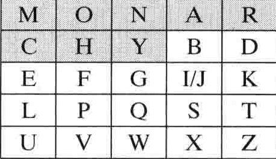
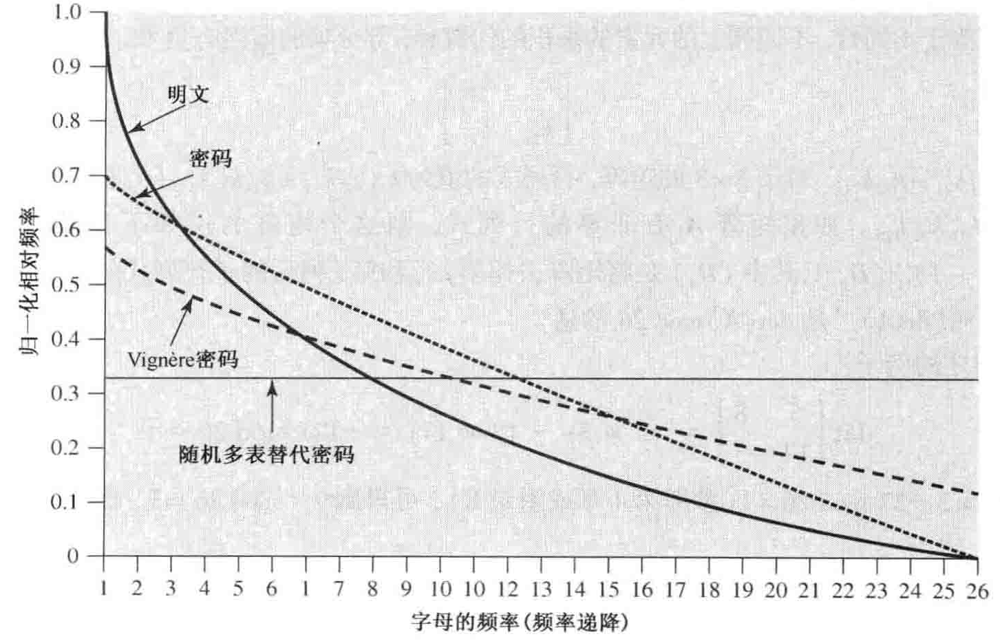

## 古典加密算法

## 两种基本技术

- 代替：将明文的字母替换成其他的数字、字母、符号；
- 置换：将信息的顺序按照某种规则打乱；

### 代替技术

#### 凯撒密码

将明文的每个字母用它的后面第三个字母代替，没有第三个则循环到开头。
例如：

- 明文：Nice to meet your
- 密文：QLFH WR PHHW BRXU

加密算法可以如此表达：

$$
C = E(3, p) = (p + 3) \mod 26
$$

移位可以是任意大小，所以恺撒密码的一般表达为：

$$
C = E(k, p) = (p + 3) \mod 26
$$

解密算法为：

$$
p = D(k, C) = (C - 3) \mod 26
$$

因为恺撒密码的以下性质，使得其很容易通过穷举破解：

1. 加解密算法已知
2. 密钥短，容易穷举
3. 语言已知，意义容易识别

#### 单表代替密码

在恺撒密码的基础上，运用置换技术将密文打乱，使得实际上每个字母的移位 $k$ 不同，密钥空间极具上升。

- **置换**：对于集合 $S = \{a, b, c\}$ 他的所有元素的一个有序排列称为一个置换，所以集合 $S$ 有 6 个置换：$abc, acb, bac, bca, cab, cba$

破解：由于单表代替带有原始字母的统计频率特征，所以可以通过统计字母的相对频率和英文文章中普遍出现的频率进行比较对比，发现其中的规律，可以部分破解密码，由于使用的语言是英语，所以可以依靠猜测将密码破解出来。

通过使用“同音字”的方法（一个字母对应多个字母进行替换），每次代替的时候，循环或随机使用“同音字”代替就好了。这种方法虽然将密文中单个元素的对应关系隐藏起来了，但是**多字母语法模式还是残留在密文**中，为密码分析提供了一种思路。
解决明文结构残留在密文中的主要方法：

- 对多个字母进行加密；
- 使用多表代替密码

#### Playfair 密码

Playfair 密码是最著名的多表替代密码。

加密过程：

1. 确定密钥词
2. 排出编码表
3. 对明文的重复字母对进行去重处理
4. 根据编码表将明文转换为密文

##### 例子

选定密钥词 monarchy 。
得到编码表：

**编码表编制规则**：将密钥词按顺序排在 $5 \times 5$ 的矩阵中，剩下的字母按照字母表顺序排列，I/L 代表同一个字母；

处理明文的重复字母对，在重复字母对中插入别的字母（具体插入什么自己定），例如：balloon 转换成 ba lx lo on。

**明文字母对处理逻辑**：

1. 落在矩阵同一行的字母对，使用向右移动一位的字母进行代替，如果到最后一个字母，循环到该行的开头取。例如：字母对 bd 用 DC 代替。
2. 落在矩阵同一列的字母对，使用向下移动一位的字母进行替代，如果到最后一个字母，循环到该列的开头取。例如：字母 pv 用 VO 代替。
3. 其余的字母对，按照行列交点进行代替。例如：hs 利用 bp 进行代替，cp 利用 HL 进行代替。

尽管 Playfair 密码看起来是安全的，但是仍然能够通过分析密码频率进行密码破译。

字母频率出现表：

曲线越平坦，代表加密效果越好，理想化的结果是完全平坦的曲线，这样代表明文中所有字母的频率都被隐藏起来了，所有字母的出现概率相等，唯密文攻击无法判断区分每个字母。

##### Hill 密码

#### 多表代替加密

##### Vigenere 密码

##### Vernam 密码

#### 一次一密

### 置换技术

按照某种规则打乱明文，不加入新的信息；

#### 一个简单的例子：栅栏技术

按照对角线的顺序写出明文，在按行写出密文；
**例**：
明文：“meet me after the toga party”
深度为 2 的加密：

然后按行写出得到密文：
MEMATRHTGPRYETEFETEOAAT
