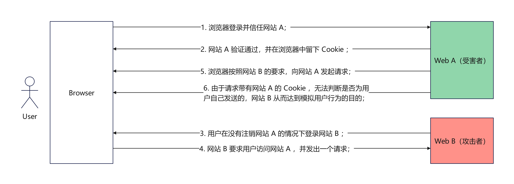

## CSRF

跨站请求伪造 Cross-site request forgery ，也被称为 one-click attack 或者 session riding 通常缩写为 CSRF 或者 XSRF。

### 攻击原理

  

从上述攻击原理图可以看出， CSRF 攻击的原因在于网站 A （受攻击网站）单凭 Cookie 无法得知用户的浏览器是否可信任。

### 防御策略

1. 验证 HTTP Referer 字段；
2. 在受限请求地址中添加 token 并验证；
3. 在 HTTP 头中自定义属性并验证；

#### HTTP Referer 字段

在 HTTP 协议中，有一个请求头字段叫 Referer 这个字段记录了该 HTTP 请求的来源地址（比如在 www.google.com 中点击超链接到 www.baidu.com ，那么发送到 baidu 服务器的请求中 Referer 中就是 www.google.com ），服务器可以校验该字段是否为自己域名下的，来判断该请求的来源是否合法；

- 优点：对于网站开发人员来说，简单易操作，只要给所有的接口添加一个统一的拦截器，校验 Referer 字段是否为当前域名的即可；
- 缺点：
  - 该安全策略依赖于浏览器对于 HTTP 协议的实现，有些浏览器（IE 6、FF2）存在安全漏洞，会被篡改 Referer 的值，导致网站误认请求来自于自己域名下而被攻击；
  - 对于 Open API 这种防护策略显然会影响业务的正常运行，比如开放的支付接口就是需要经过别的网站发起的调用的；

#### token 验证

由于 CSRF 发生原理是由于攻击者可以在用户的浏览器端伪造请求欺骗受害网站，所以我们可以验证浏览器的请求中是否有 token 来判断请求是否伪造的。这个 token 不能放在 Cookie 中，需要在用户登录的是否随机生成，放在服务器的 session 中，并在每次请求中以参数的形式返回给用户，并隐藏起来。

- 优点：比 Referer 更加安全；
- 缺点：
  - 需要给每个接口都添加 token 参数，前端实现繁琐，容易有漏网之鱼；
  - 对于支持用户自己发布内容的系统，比如论坛、博客网站等，黑客可以在发布内容中写上自己的网站链接，如果网站没有判断该连接是否为外链，就当作是自己系统的链接给他加上了 CSRF token 那么当网站用户点击该地址，黑客网站拿到用户的 token 便马上可以发起 CSRF 攻击；
  - 即使 token 没有以请求的方式添加在链接中，黑客也可能通过 Referer 中获取到 token；

#### 请求头验证

该方法也是使用 token 防止黑客篡改，只不过 token 不是在参数中传输，而是在请求头中传输；

- 优点：
  - token 不会被记录到地址栏中；
  - token 不会在 Referer 中泄露；
  - 前端实现比上一种方式的实现简单，可以通过 XMLHttpRequest 一次性给所有的请求都加上请求头 token ；
- 缺点：
  - 请求页面不会被浏览器记录，从而前进、后退、刷新、收藏等操作无效；
  - 对于没有 CSRF 防护的网站来说，请求方式需要全部替换成 XMLHttpRequest 请求，成本高；
