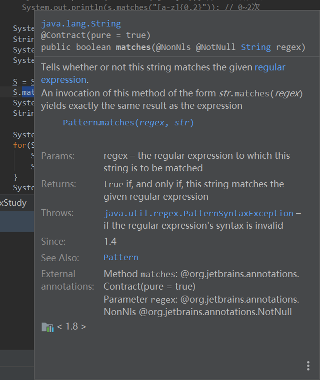

## 如何在 IDEA 中快速查看 Java doc？

### 选中需要查看的函数名（类名）

`Ctrl` + `W` 可以快速阔选光标所在的单词（和我的习惯按键冲突了，所以我改成了 `Alt` + `W` ，在 `Setting` 中的 `Keymap` 中搜索 `Extend Selection` 即可，相应的还有 `Shrink Selection` 我配置的时 `Shift` + `W` 。

### 打开相应的 Java Doc

`Ctrl` + `W` 便可以打开 Java Doc 文档了。

