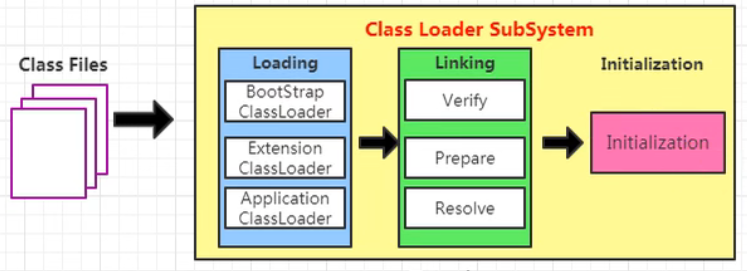

## 类加载机制

### 类的加载过程

类的加载过程：（Load-Link-Initialize）



1. 类的加载（Load）：
    - 通过类的全限定名获取定义此类的二进制字节流；
    - 将这个字节流所代表的静态存储结构转化为方法区的运行时数据结构；
    - 在内存中创建一个代表这个类的 `java.lang.Class` 对象，作为方法区这个类的各种数据的访问入口；
    - 整个过程由类加载器完成；
2. 类的链接（Link）：将类的二进制数据合并到 JRE 中；
    - 验证：确保加载的类信息符合 JVM 规范，不会出现安全问题；
    - 准备：正式为 **类变量** （static 变量，不包括 static final 常量，常量在编译阶段便分配了内存，准备阶段会显式初始化）分配内存并设置 **默认初始值** （零值），这些内存都在 **方法区** 中进行分配；
    - 解析：虚拟机常量池内的符号引用（常量名）替换为直接引用（地址）的过程；
3. 类的初始化（Initialize）：JVM 负责对类进行初始化；
    - 执行类构造器 `<clinit>()` 方法的过程。类构造器 `<clinit>()` 方法，是由编译器自动收集类中所有 **类变量** 的赋值和 **静态代码块** 中的语句合并产生的；（类构造器是构造类信息的，不是构造类对象的）
    - 当初始化一个类的时候，如果发现其父类还没有初始化，则需要先触发其父类的初始化；（双亲委派机制）
    - 虚拟机会保证一个类的方法在多线程的环境中被正确加锁和同步；

> 看一段代码：
>
> ```java
> private static Integer a = 2;
>
> static {
>    a = 3;
>    num = 200; // 这里的赋值是合法的，因为 static 变量在 linking 阶段的 prepare 就已经分配了内存并设置了初始默认值，所以这里的赋值是成功的
>    // System.out.println(num); // 这是会编译出错的，会发生非法的前向引用错误
> }
>
> private static int num = 10;
> ```

#### 类的初始化

类的初始化触发分为下面两种情况：

1. 类的主动引用（一定会发生类的初始化）
    - 当虚拟机启动，先初始化 ma`in 方法所在的类；
    - `new` 一个类的对象；
    - 调用类的静态成员（除了 `final` 常量）和静态方法；
    - 使用 `java.lang.reflect` 包的方法对类进行反射调用；
    - 当初始化一个类，如果其父类没有被初始化，则先会初始化它的父类；
    - JDK 7 开始提供了动态语言的支持：
        - `java.lang.invoke.MethodHandle` 实例的解析结果；
        - `REF_getStatic` 、 `REF_putStatic` 、 `REF_invokeStatic` 句柄对应的类没有初始化，则初始化；
2. 类的被动引用（不会发生类的初始化）
    - 当访问一个静态域时，只有真正声明这个域的类才会被初始化。如：当通过子类引用父类的静态变量，不会导致子类初始化；
    - 通过数组定义类引用，不会触发此类的初始化，`Son[] array = new Son[5];`；
    - 引用常量不会触发此类的初始化（常量在链接阶段就存入调用类的常量池中了）；
    - 其他操作……

##### 执行 `<clinit>()`

类的初始化阶段就是执行类构造器 `<clinit>()` 方法。
`<clinit>()` 由编译器自动收集的，所有 **类变量的赋值动作** 和 **静态语句块**，合并产生的。收集顺序由源码的出现顺序决定。
静态语句块中只能访问定义在其之前的变量，对于定义在其后的变量，语句块能够 **赋值** ， **不能访问** （会报非法向前引用变量的错误）。

`<clinit>()` 方法与类的构造函数（`<init>()` 方法不同），它不需要显式地调用父类构造器，虚拟机会自己保证父类的 `<clinit>()` 先执行。所以最先执行的 `<clinit>()` 是 `java.lang.Object` 的。

### 实例：分析下面代码的加载过程

```java
public class ClinitTest1 {
    static class Father {
        public static int A = 1;
        static {
            A = 2;
        }
    }

    static class Son extends Father {
        public static int B = A;
    }

    public static void main(String[] args) {
        System.out.println(Son.B); // 2
    }
}
```

1. 首先加载 main 方法所在的类 `ClinitTest1` ；
2. 开始执行 main 方法，遇到调用 `Son.B` ，开始加载 `Son` 类，执行 `<clinit>` ；
3. 由于 `Son` 类有父类 `Father` ， **双亲委派机制** ，先执行 `Father` 的 `<clinit>` ，加载父类先；
4. 父类的 static 变量经过加载链接初始化之后， `A = 2` ；
5. 然后执行 `Son` 的 `<clinit>` ，得到 `B = 2` ；
6. 最后输出为 2 ；
7. 虚拟机必须保证一个类的 `<clinit>()` 方法在多线程下被 **同步加锁** ；

第 7 点可以用以下代码验证：

```java
public class DeadThreadTest {
    public static void main(String[] args) {
        Runnable task = () -> {
            System.out.println(Thread.currentThread().getName() + "开始");
            DeadThread deadThread = new DeadThread();
            System.out.println(Thread.currentThread().getName() + "结束");
        };

        Thread thread1 = new Thread(task, "线程1");
        Thread thread2 = new Thread(task, "线程2");

        thread1.start();
        thread2.start();
    }

}

class DeadThread {
    // <clint> 方法，将被 jvm 同步加锁
    static {
        if (true) {
            System.out.println(Thread.currentThread().getName() + "初始化 DeadThread");
            while (true) {
                // 其中一个线程会被卡在这里，而另外一个线程由于得不到锁，所以两个线程都无法输出结束
            }
        }
    }
}
```

#### 类的加载器

类加载器（ClassLoader）的作用就是用来把类装载进内存的。JVM 规范定义了如下几类加载器：

-   引导类加载器：用 C++ 编写的，是 JVM 自带的类加载器，负责 Java 平台核心库，用来装载核心类库。**无法直接获取。**
-   扩展类加载器：负责 `re/lib/ext` 目录下的 jar 包或 `-D java.ext.dirs` 指定目录下的 jar 包装入工作库；
-   系统类加载器：负责 `java-classpath` 或 `-D java.class.path` 所指的目录下的类与 jar 包装入工作，是最常用的加载器；
-   用户自定义加载器：用户自定义；

这里的四种加载器之间的关系不是上下级、不是继承关系，而是包含关系。

这三个类加载器以及自定义加载器的层次结构如下：


在代码中，类加载器的关系如下（这里只有 `ExtClassLoader` 和 `AppClassLoader` 没有 `BootstrapClassLoader` ，因为引导类加载器是 C/C++ 编写的，不在 java 源码里面）：


`sun.misc.Launcher` 是 JVM 的入口应用， `ExtClassLoader` 和 `AppClassLoader` 都是 `Launcher` 的内部类。

这些类加载器是自上而下加载，自下而上检查是否加载完成的。此外我们还可以自定义类加载器；

```java
// 获取系统类加载器
ClassLoader systemClassLoader = ClassLoader.getSystemClassLoader();

// 获取系统类加载器的父类加载器-->扩展类加载器
ClassLoader extClassLoader = systemClassLoader.getParent();

// 获取扩展类加载器的父类加载器-->根加载器（是用C/C++写的）
ClassLoader rootClassLoader = systemClassLoader.getParent(); //null，因为无法获取

// 获得系统类加载器可以加载的路径
System.getProperty("java.class.path");
```

#### 双亲委派机制

JVM **按需** 加载 class 文件，只有当使用到某个类时才会将 class 文件加载到内存生成类对象。加载时采用的时双亲委派机制，把请求交给父类处理，是一种任务委派模式。

**双亲委派机制**：加载 `java.lang.String` 类时，JVM 会从用户自定义的类加载器开始（如果有）向上到 `AppClassLoader` 再向上到 `ExtClassLoader` 直到 `BootstrapClassLoader` 。一步步将加载任务委派给上一级的类加载器，如果上一级的类加载器能够加载就加载，不能再由下一级类加载器加载，是个递归的操作。这样做也可以保证程序的安全性，比如 java 的核心类库不会被用户自定义的类覆盖，如果没有用双亲委派机制加载，那对于从网络中获取字节码加载的场景，就会有攻击注入的风险。

在双亲委派加载过程中，每个类只会被加载一次，不会被重复加载。而且可以保护系统核心 API ，当加载到自定义的 `java.*` 或者 `javax.*` 等包（即试图使用引导类加载器加载用户自定义类），会发生安全异常。这种保护又叫做 **沙箱安全机制**。

### 其他

判断 JVM 中两个 Class 对象是否一样：

1. 类的全限定名是否一致；
2. 加载类的 classLoader 必须相同；

对于用户类加载器加载的类， **JVM 会将类加载器的引用作为类型信息的一部分保存在方法区中** 。当解析一个类型到另一个类型的引用的时候， JVM 需要保证这两个类型的类加载器是相同的。

