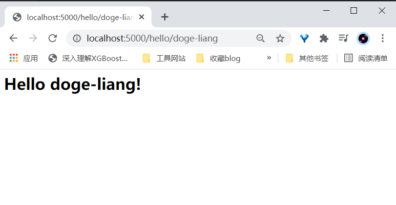

## flask 入门

-   [flask 入门](#flask-入门)
    -   [Hello World](#hello-world)

### Hello World

第一个 Hello World 程序：

```python
from flask import Flask
from flask import request
from flask import redirect
from flask import abort
from flask import make_response

app = Flask(__name__)


# 简单的路由示例
@app.route('/')
def index():
    user_agent = request.headers.get('User-Agent')
    return '<p>Your browser is %s</p>' % user_agent


# 动态路由 name 作为 url 参数传入
@app.route('/hello/<name>')
def hello(name):
    return '<h1>Hello %s!</h1>' % name


# 带有状态码的返回值
@app.route('/404')
def notFound():
    return '<h1>Not Found</h1>', 404


# 重定向测试
@app.route('/redirect')
def redirectto():
    return redirect('https://www.baidu.com')


# abort 错误处理函数测试
@app.route('/abort')
def aborttest():
    abort(404)
    # abort() 被调用之后不会再回到这个函数
    # 而是直接将控制权交给 Web 服务器
    return '<h1>Not Found</h1>', 404


# make_response 建立响应测试
@app.route('/test_response')
def responseTest():
    response = make_response('<h1>This document carries a cookie!</h1>')
    response.set_cookie('answer', '42')
    return response


if __name__ == '__main__':
    app.run(debug=True)

```

打开浏览器输入 `localhost:5000` 就能看到以下图片：


这是 `index()` 方法返回的结果；



这是 `hello(name)` 方法的返回结果；

输入 `@app.route()` 内部对应的路径，就能够进入到对应的视图函数。

> 视图函数：就是上面定义的那一个个的函数

