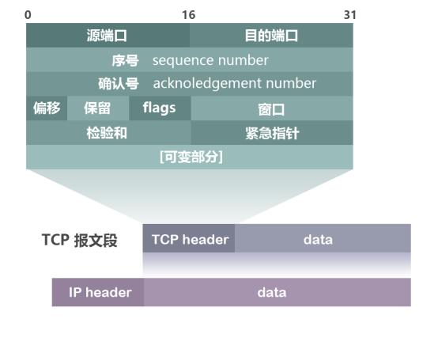
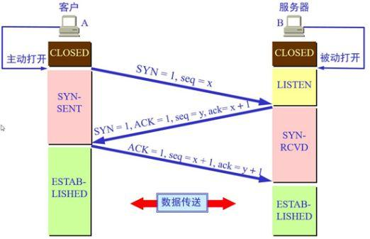

## 第 5 章-传输层

# 传输层

## TCP 协议

TCP 协议工作在传输层，是应用层协议的工作基础。

- HTTP/1.0 时代，TCP 连接是随着 HTTP 协议打开关闭的，每次打开关闭 TCP 连接都需要七次网络通信，如果都是和同一台服务器进行 HTTP 通信，那么就会造成资源的浪费；
- HTTP/1.1 时代，可以以某种方式声明 TCP 连接的保持，减少了无用的连接建立消耗；
- HTTP/2 中，更是可以在同一个 TCP 连接上并发地进行 HTTP 通信；

### TCP 报文的结构

其中，重要的字段有：

1. 序号（sequence number）：占 32 位，用来标识从源端到目的端的字节流，防止混淆；
2. 确认号（acknowledgement number）：占 32 位，只有 flags 中的 ACK 位为 1 时，才有效，ack = seq + 1 ；
3. flags（标志位）：共有六个，含义分别如下：
   - URG：紧急指针（urgent pointer）有效；
   - ACK：确认序号有效；
   - PSH：表示接收方应该尽快将这个报文发送给应用层；
   - RST：重置连接；
   - SYN：建立一个新的连接；
   - FIN：释放现有的连接；

> ps:不要搞混了确认号 ack 和标志位 ACK 前者是表示确认上一个收到的 TCP 数据段（segment）的序号为 ack - 1，后者是表示该数据段为确认请求的数据段；

### 建立连接——三次握手

上图的 TCP 建立请求的状态图，

1. 一开始服务器打开端口并进入监听状态；
2. 客户端发送 SYN 请求建立连接，进入 SYN-SENT 状态；
3. 服务端收到 SYN 请求，回复 ACK 请求，表示收到客户端的建立连接请求，进入 SYN-RCVD 状态；
4. 客户端收到 ACK 请求之后，回复 ACK 请求表示收到了服务端的 ACK 请求了，正式建立连接开始数据的传送（ESTABLISHED）；
5. 服务端收到 ACK 请求之后，也正式建立连接开始数据的传送；

### 释放连接——四次挥手
